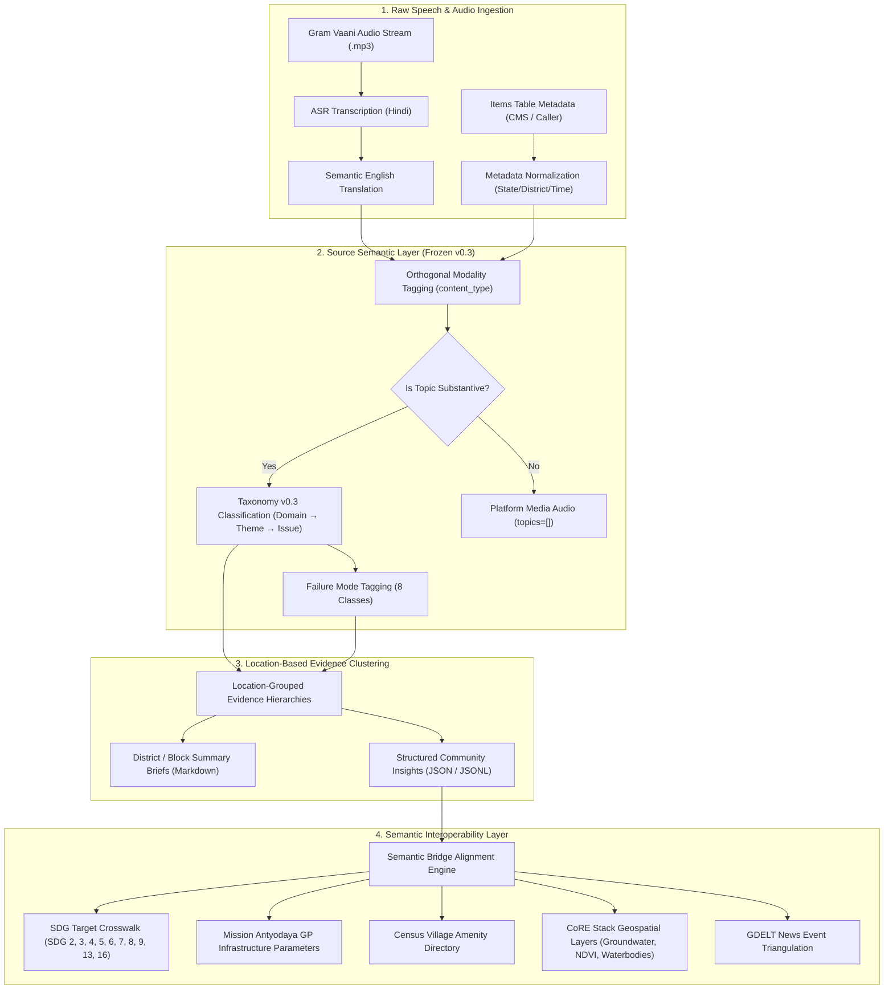

# Gram Vaani Semantic Indicator Interoperability & Alignment Architecture

## 1. Executive Summary & Design Philosophy
This document specifies the conceptual "Semantic Bridge" that allows Gram Vaani community voice insights to interoperate with standardized national and international indicator systems:
- **United Nations Sustainable Development Goals (SDGs)**
- **Census of India Village Amenities & Household Census**
- **Ministry of Panchayati Raj / MoRD Mission Antyodaya Indicators**
- **CoRE Stack Geospatial Socio-Ecological Data Layers**
- **GDELT Event and Tone News Monitoring**

### The Inviolable Architectural Principle:
```text
Gram Vaani Community Voice Evidence (Ground Truth)
                       ↓
Gram Vaani Corpus-Grounded Taxonomy v0.3 (Source Semantic Layer)
                       ↓
       Gram Vaani Structured Community Insights
                       ↓
       Semantic Bridge & Alignment Layer (Optional Projections)
  ┌────────────┬───────────────┬─────────────────┬──────────────┐
  ↓            ↓               ↓                 ↓              ↓
 SDGs        Census     Mission Antyodaya    CoRE Stack       GDELT
```
> **Taxonomy v0.3 is NOT an SDG taxonomy and MUST remain independent.**
> Community evidence is NEVER forced directly into an external code. The GV Taxonomy represents what citizens actually speak about, while the Interoperability Layer projects these concepts onto external frameworks as secondary contextualization overlays.

---

## 2. The Semantic Bridge Architecture

The Semantic Bridge defines how a GV Taxonomy Issue maps to external framework indicators through **explicit relationship types**:

| Relationship Type ID | Relationship Name | Semantic Definition | Example Mapping |
| :--- | :--- | :--- | :--- |
| `direct_correspondence` | Direct Semantic Match | The GV issue and external indicator measure the exact same functional phenomenon. | `PDS Ration Under-weighing` $\longleftrightarrow$ Mission Antyodaya `Fair Price Shop Operationality`. |
| `narrower_concept` | Specific Sub-Component | The GV issue captures a specific operational failure mode within a broader external indicator. | `Doctor Absenteeism` $\longrightarrow$ SDG 3.8.1 `Coverage of Essential Health Services`. |
| `broader_concept` | Macro Community Theme | The GV issue encompasses multiple discrete indicator parameters. | `Dilapidated Roads & Culverts` $\longleftarrow$ PMGSY / Census `Pucca Road Connectivity` + `All-Weather Access`. |
| `contextual_relationship` | Functional Grounding | The GV issue provides real-time operational status for a static infrastructure asset. | `Burnt Transformer` $\longleftrightarrow$ Census `Village Domestic Electrification Status (Yes/No)`. |
| `no_reliable_correspondence`| Community-Unique Phenomenon | The GV issue reflects grassroots socio-cultural dynamics absent from formal government metrics. | `Folk Cultural Expression & Festival Songs` $\longleftrightarrow$ `None`. |

---

## 3. End-to-End Pipeline Architecture Diagram



---

## 4. Indicator-Ready Conceptual JSON Data Model

```json
{
  "insight_id": "INS_0019",
  "taxonomy_version": "0.3-FROZEN",
  "location": {
    "district": "Samastipur",
    "state": "Bihar",
    "location_source": "metadata"
  },
  "taxonomy_concept": {
    "domain_id": "energy_and_electrification",
    "domain_name": "Energy & Rural Electrification",
    "theme_id": "rural_electricity_grid",
    "theme_name": "Rural Electricity & Power Grid",
    "issue_id": "frequent_power_outages_and_transformers",
    "issue_name": "Frequent Power Outages, Low Voltage & Burnt Transformers"
  },
  "community_observation": {
    "finding": "Callers in Samastipur report recurrent transformer burnout and unaddressed power outages disrupting domestic lighting and tubewell irrigation.",
    "failure_modes": ["infrastructure_damage", "non_responsiveness"],
    "evidence_count": 3
  },
  "external_indicator_alignments": {
    "sdg_alignment": [
      {
        "framework": "UN-SDG",
        "goal": "SDG 7: Affordable and Clean Energy",
        "target": "7.1: Universal access to affordable, reliable and modern energy services",
        "indicator_code": "7.1.1",
        "relationship_type": "narrower_concept",
        "mapping_justification": "Transformer breakdown represents an acute reliability and last-mile quality deficit under SDG 7.1.1 electricity access.",
        "mapping_confidence": "high"
      }
    ],
    "mission_antyodaya_alignment": [
      {
        "framework": "Mission_Antyodaya_2022",
        "sector": "Electricity Supply",
        "parameter_code": "MA_ELEC_02",
        "parameter_name": "Average hours of domestic electricity supply per day in Gram Panchayat",
        "relationship_type": "contextual_relationship",
        "mapping_justification": "Citizen complaints of burnt transformers directly explain drops in official daily electricity hours.",
        "mapping_confidence": "high"
      }
    ],
    "census_alignment": [
      {
        "framework": "Census_2011_Village_Directory",
        "table": "DCHB_Village_Amenities",
        "attribute": "Power Supply (Domestic / Agriculture)",
        "relationship_type": "contextual_relationship",
        "mapping_justification": "Provides real-time functional status over decennial static village electrification status.",
        "mapping_confidence": "high"
      }
    ],
    "core_stack_alignment": [
      {
        "framework": "CoRE_Stack",
        "layer_name": "Agricultural Tubewell Power Reliability Layer",
        "spatial_resolution": "Gram_Panchayat",
        "relationship_type": "related_concept",
        "mapping_justification": "Can be overlaid on groundwater irrigation pumping maps to model agricultural drought risk.",
        "mapping_confidence": "medium"
      }
    ]
  },
  "provenance_citations": ["01-00096-01", "01-00355-03", "13-00073-02"]
}
```
