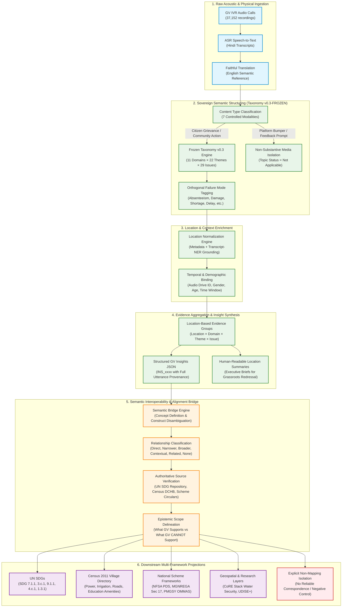

# Gram Vaani Community Voice AI & External Indicator Alignment Architecture

## 1. Executive Summary

This document specifies the end-to-end technical and conceptual architecture connecting raw Gram Vaani (GV) community voice recordings to formal socio-economic, administrative, and ecological development indicators (UN Sustainable Development Goals, Census of India 2011 Village Directory, National Food Security Act, MGNREGA Scheme Monitoring, UDISE+, and CoRE Stack).

The fundamental architectural principle of this system is **Epistemic Independence and Downstream Projection**:
1. **The Gram Vaani Semantic Taxonomy (v0.3-FROZEN) is sovereign and independent.** It is structured around the lived reality and everyday language of rural community members, not pre-conditioned on government administrative metrics or international development goals.
2. **External indicator frameworks are optional downstream projections.** A GV community insight exists as an independently grounded, verifiable observation regardless of whether an external indicator mapping exists.
3. **Strict separation between qualitative citizen evidence and official administrative measurement.** Grounded community voice reports operational friction, service breakdown, asset degradation, and lived bottlenecks; it does NOT measure population denominators, statistical prevalence rates, or macro-level coverage indices.

---

## 2. End-to-End Indicator Alignment Flow

The complete data pipeline from physical acoustic audio to multi-framework indicator alignment is illustrated in the diagram below:



---

## 3. Tripartite Epistemic Layering

A critical flaw in standard AI-driven development dashboards is the conflation of citizen complaints with official statistical metrics. To ensure scientific integrity, the Gram Vaani interoperability architecture enforces a strict tripartite separation:

```text
┌─────────────────────────────────────────────────────────────────────────────┐
│ 1. GROUNDED GRAM VAANI COMMUNITY EVIDENCE (Empirical Ground Truth)          │
│ • Unit: Individual spoken citizen utterance (utt_id).                       │
│ • Content: Lived experience, local problem reports, specific facility state.│
│ • Epistemic Status: Direct testimony of community reality.                  │
│ • Example: "Agera PHC doctor was absent on Monday; clinic remained locked." │
└──────────────────────────────────────┬──────────────────────────────────────┘
                                       │
                                       ▼ (Mapped via Semantic Bridge)
┌─────────────────────────────────────────────────────────────────────────────┐
│ 2. EXTERNAL FRAMEWORK INTERPRETATION (Semantic Crosswalk Layer)             │
│ • Unit: Standardized development concept (SDG target, Census variable).     │
│ • Relationship: narrower_concept / contextual_relationship.                 │
│ • Epistemic Status: Relational hypothesis linking local event to construct. │
│ • Example: "Doctor absenteeism represents local operational friction within │
│             SDG 3.c.1 (Health worker density and distribution)."            │
└──────────────────────────────────────┬──────────────────────────────────────┘
                                       │
                                       ▼ (Contrasted with, NEVER Conflated with)
┌─────────────────────────────────────────────────────────────────────────────┐
│ 3. OFFICIAL ADMINISTRATIVE MEASUREMENT (Macro Statistical Ground Truth)     │
│ • Unit: State / National administrative census or survey indicator.         │
│ • Source: WHO, MoHFW, Census of India, NFHS-5, NREGASoft MIS.               │
│ • Epistemic Status: Formal statistical measurement over defined denominator.│
│ • Example: "Bihar state physician density is 3.1 per 10,000 population."    │
└─────────────────────────────────────────────────────────────────────────────┘
```

### Critical Boundaries
1. **Never Calculate Indicator Denominators from Voice Calls**: 10 calls reporting burnt transformers in Madhubani does NOT mean "10% of Madhubani is without power". It establishes that transformer breakdown is an active, unresolved community grievance in specific named habitations.
2. **Never Conflate Physical Asset Presence with Functional Operationality**: A village recorded in Census 2011 as having `POWER_SUP = 'Y'` (electrified) may experience 18 hours of daily outages. GV captures the *dynamic functional reality* that static census records miss.
3. **Never Convert Qualitative Friction into Formal Prevalence**: A grievance regarding PDS dealer under-weighing (2 kg/card) proves *statutory delivery leakage*, but cannot establish the district-wide Food Insecurity Experience Scale (FIES) percentage under SDG 2.1.2.

---

## 4. The 6-Tier Semantic Relationship Taxonomy

To eliminate arbitrary or hallucinated mappings, every linkage between a Gram Vaani taxonomy concept and an external framework must be categorized into one of six mutually exclusive relationship types:

| Relationship Type | Formal Definition | Applied Example in GV | Mapping Rule |
| :--- | :--- | :--- | :--- |
| **`direct_correspondence`** | The GV evidence captures essentially the exact construct defined by the external indicator. | School toilet functionality (`SDG 4.a.1(d)` / School Sanitation). | Use only when construct, scope, and operational definition match directly. |
| **`narrower_concept`** | GV captures a specific, localized sub-phenomenon that sits entirely within a broader macro indicator. | Local doctor absenteeism at PHC $\rightarrow$ `SDG 3.c.1` (Health worker density & distribution). | Use when GV provides granular operational evidence for a broader target. |
| **`broader_concept`** | GV describes an overarching community reality that encompasses multiple specific administrative variables. | General rural distress $\rightarrow$ Specific scheme application backlog. | Use when citizen grievance spans across multiple narrow bureaucratic fields. |
| **`contextual_relationship`** | GV provides vital operational or qualitative context relevant to an indicator, but measures a different construct. | Feeder load-shedding hours $\leftrightarrow$ `SDG 7.1.1` (Binary household grid connection rate). | Use when external metric tracks structural presence, but GV tracks operational quality. |
| **`related_concept`** | Meaningful semantic relationship exists, but definitions or boundaries cannot be formally aligned. | Farmer rainfall dependency $\leftrightarrow$ `CoRE Stack` Groundwater level (m bgl). | Use when concepts interact ecologically or economically without equivalence. |
| **`no_reliable_correspondence`** | No valid conceptual or empirical relationship exists between the GV recording and development frameworks. | Radio station broadcast bumpers, host greetings, listener feedback prompts $\leftrightarrow$ None. | **Mandatory Refusal**: Isolate non-substantive media to prevent hallucinated mappings. |

---

## 5. Architectural Guardrails & Safety Measures

1. **Zero-Hallucination Identifier Rule**: No invented variable codes (such as `MA_HLTH_01` or `CENS_POW_02`) are permitted. All external indicator codes must be verified against official custodial repositories (e.g. UN SDG Metadata Repository, Census Village Directory DCHB, MoRD Circulars). Unverified concepts must be marked as `unverified_identifier` or kept at the narrative framework level.
2. **Immutable Provenance Traceability**: Every mapped insight must preserve the complete chain of custody:
   `Alignment ID` $\rightarrow$ `GV Insight ID` $\rightarrow$ `Evidence Group ID` $\rightarrow$ `Utterance IDs` $\rightarrow$ `Acoustic Audio Path & Hindi Transcript`.
3. **Non-Substantive Media Isolation**: Controlled modalities (platform bumpers, IVR prompts, host chit-chat) are structurally routed to `no_reliable_correspondence` and rejected from development indicator pipelines.
4. **Independent Evolution**: Future changes to UN SDG methodologies or Census variable definitions do not impact the frozen Gram Vaani Taxonomy v0.3. The semantic bridge is a separate, modular configuration layer.
